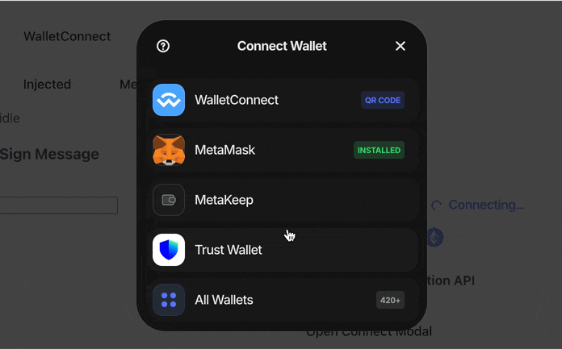

# metakeep-wagmi-connector

<p align="center">
  
</p>

[](https://www.npmjs.com/package/@belongnet/metakeep-wagmi-connector)
[](https://www.npmjs.com/package/@belongnet/metakeep-wagmi-connector)
[](https://packagephobia.com/result?p=@belongnet/metakeep-wagmi-connector)

Connector for integrating [wagmi v2.x](https://wagmi.sh/) with the [MetaKeep.xyz](https://metakeep.xyz/) platform.

- [👀 Demo](https://belongnet.github.io/metakeep-wagmi-connector/)

**Features:**

- ⚙ Connects with [wagmi v2](https://wagmi.sh/)
- 🔮 Supports [Web3Modal](https://docs.walletconnect.com/web3modal/about)
- 📐 Session validations and caching
- 🔐 Supports One-Click Auth / SIWE
- 💡 Lightweight ~26kB
- ✍️ TypeScript/ESM/Dynamic import

## Installation

You can install **metakeep-wagmi-connector** using npm, yarn, or pnpm:

```bash
pnpm add @belongnet/metakeep-wagmi-connector
```

Once installed, add **metakeep** to your wagmi configuration as a connector. Here's a sample configuration:

```ts
import { metaKeep } from '@belongnet/metakeep-wagmi-connector'

const config = createConfig({
  // ...
  connectors: [
    metaKeep({
      appId: import.meta.env.VITE_META_KEEP_APP_ID,
    }),
  ],
})
```

Make sure to set the `appId` in your environment variables, for example in a `.env` file:

```env
VITE_META_KEEP_APP_ID=your-app-id
```

Enjoy!

## Usage

The connector will automatically handle the authentication process with wagmi. see the [wagmi documentation](https://wagmi.sh/) for more information.

```ts
const { connect } = useConnect()

connect({ connector: 'metakeep' })
```

### Metakeep Provider access

You can use the [useAccount](https://wagmi.sh/react/api/hooks/useAccount#connector) hook to access the native connector provider.

> [!WARNING]
> Use this only if you know what you're doing. Instead, it's better to utilize methods at the wagmi level.

```ts
import type { MetaKeepProvider } from '@belongnet/metakeep-wagmi-connector'

const { connector } = useAccount()

const provider = <MetaKeepProvider>await connector.value?.getProvider()

const authorizedUser = provider.getUser()
console.log(authorizedUser)
```

## Migration Guide

- [Migrate from Wagmi v1 to v2](docs/migration-guide.md)

## Links

- https://docs.metakeep.xyz/reference/web3-provider
- https://github.com/PassbirdCo

# Related connectors

- https://wagmi.sh/dev/creating-connectors
- https://github.com/blocto/blocto-sdk/blob/develop/adapters/wagmi-connector/src/connector.ts
- https://github.com/magiclabs/wagmi-magic-connector/blob/main/src/lib/connectors/dedicatedWalletConnector.ts
- https://github.com/Web3Auth/web3auth-wagmi-connector/blob/master/src/lib/connector.ts

## License

This project is licensed under the terms of the [MIT license](LICENSE).
